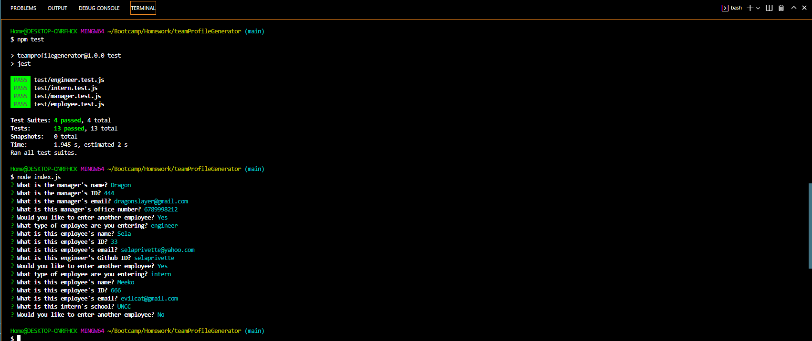

# teamProfileGenerator

## Table of Contents
1. [Description](#description)
2. [Visuals](#visuals)
3. [Resources](#resources)

## Description
This application creates an HTML page based off the information the user fills out. This is ran by a Node.js command and allows you to enter in information for each employee and will then produce it onto an HTML file that is stored in the output folder. The information is also tested to make sure it passes.

## Visuals

![Video] (img/walkthrough.mp4)

## Resources
- [VideoLink] (https://www.awesomescreenshot.com/video/9739072?key=cca9f716a42ba14cd15869447c2766c7)
- [Repository](https://github.com/selaprivette/teamProfileGenerator)

